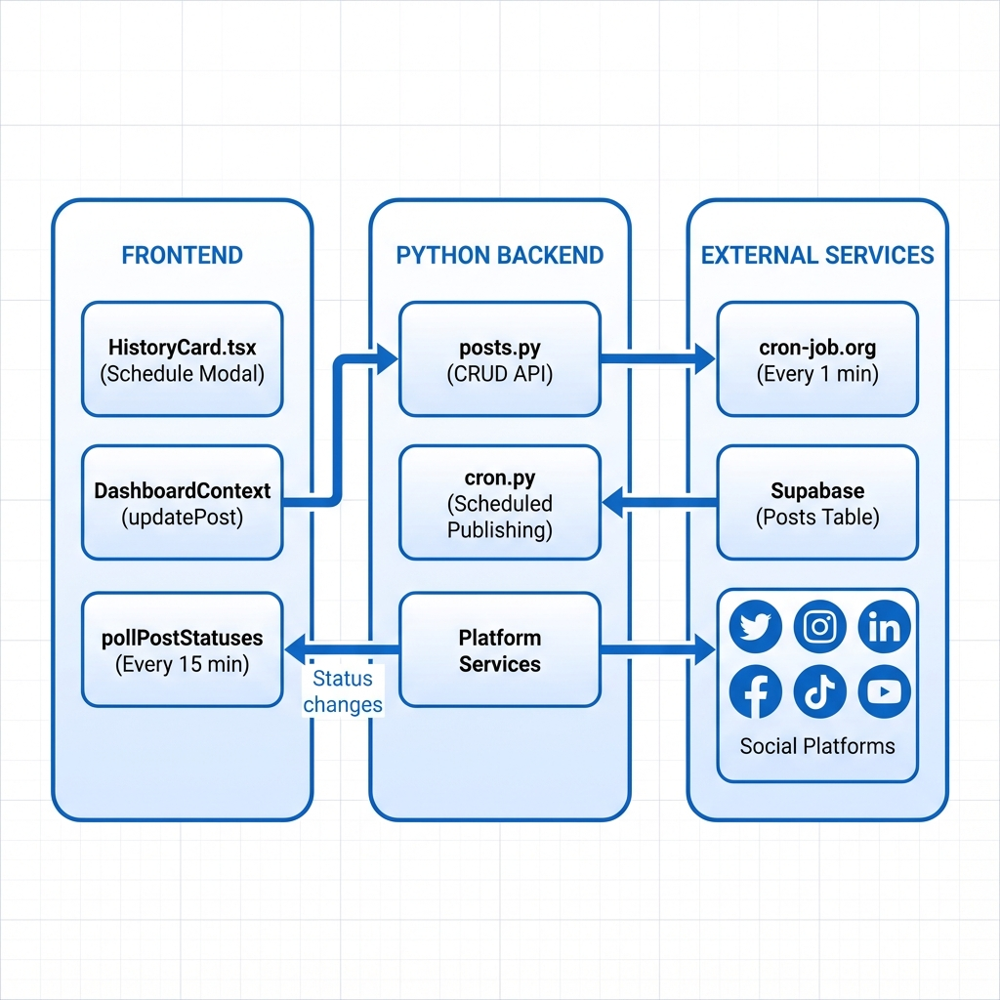
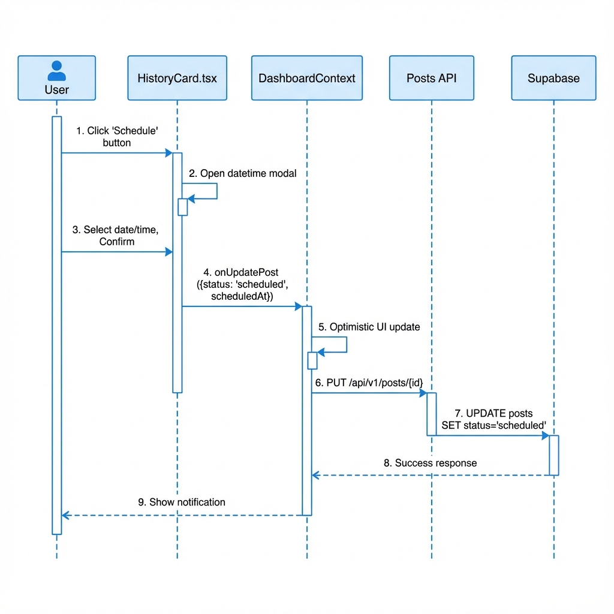
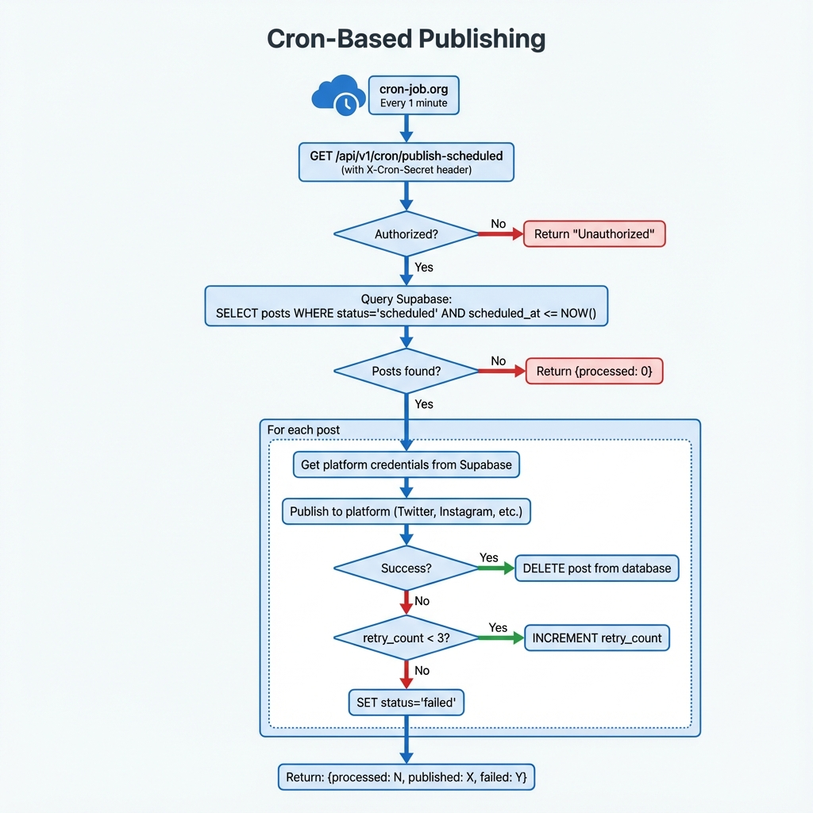
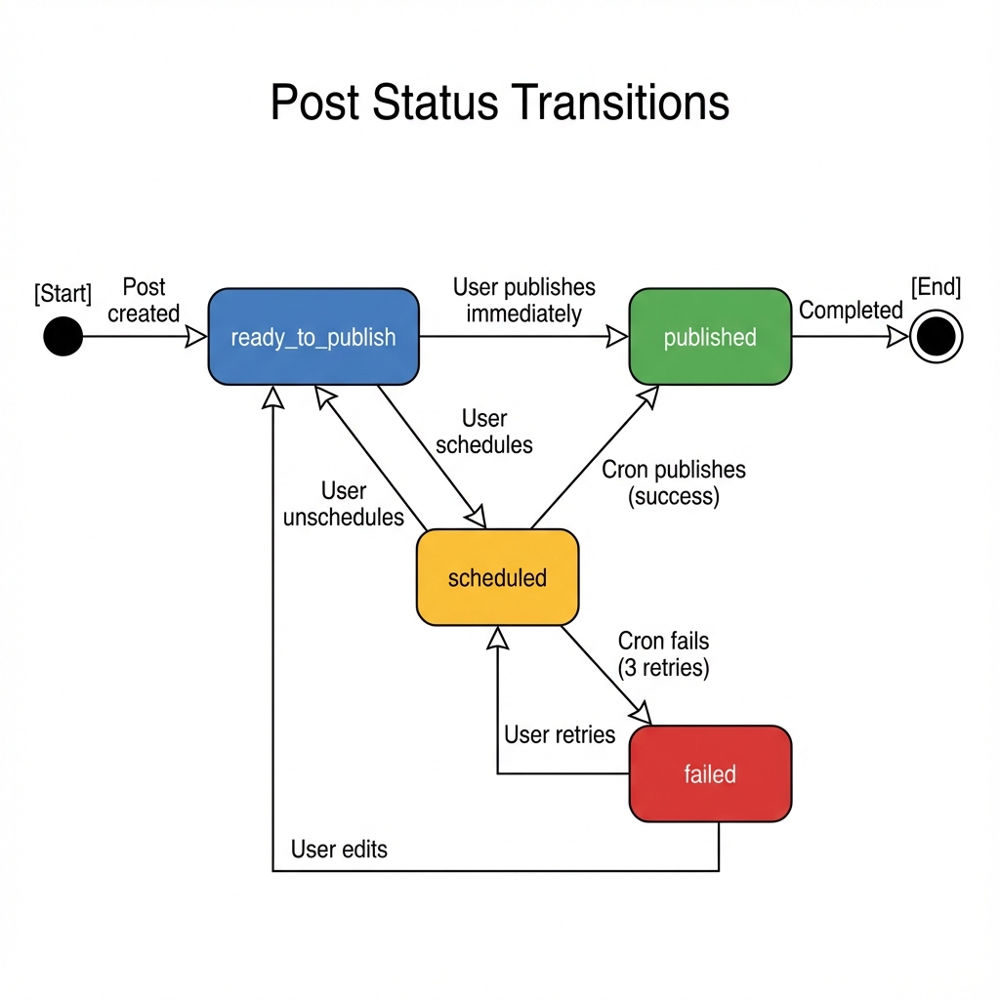
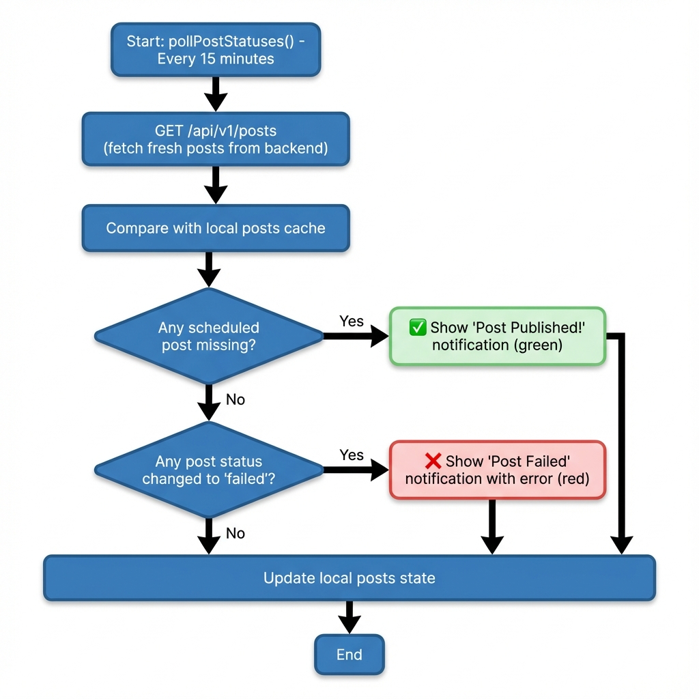

# Scheduled Publishing Architecture

> **Version:** 1.0.0  
> **Last Updated:** December 2025  
> **Status:** Production Ready

This document provides a comprehensive overview of the scheduled post publishing system, including the scheduling workflow, cron-based publishing, and integration with external cron services.

---

## Table of Contents

1. [System Overview](#system-overview)
2. [Architecture Components](#architecture-components)
3. [Scheduling Workflow](#scheduling-workflow)
4. [Cron-Based Publishing](#cron-based-publishing)
5. [Database Schema](#database-schema)
6. [API Endpoints](#api-endpoints)
7. [Status Detection & Notifications](#status-detection--notifications)
8. [Configuration & Setup](#configuration--setup)
9. [Error Handling & Retries](#error-handling--retries)
10. [Security Considerations](#security-considerations)

---

## System Overview

The scheduled publishing system enables users to:
- Schedule posts for future publication
- Automatically publish at the scheduled time via cron job
- Detect publishing success/failure through status polling
- Receive notifications for published or failed posts

### High-Level Architecture

### Architecture Layers

| Layer | Technology | Responsibility |
|-------|------------|----------------|
| Frontend | Next.js + React | Schedule UI, Status Polling, Notifications |
| Backend API | FastAPI (Python) | Post CRUD, Credential Management |
| Cron Endpoint | FastAPI (Python) | Scheduled Publishing Logic |
| Scheduler | cron-job.org | External trigger every minute |
| Database | Supabase (PostgreSQL) | Posts, Credentials, Activity Logs |
| Platforms | Twitter, Instagram, etc. | Content Publishing |

---

## Architecture Components

### Backend Key Files

| File | Purpose |
|------|---------|
| `api/v1/posts.py` | Post CRUD operations |
| `api/v1/cron.py` | Scheduled publishing endpoint |
| `services/platforms/*.py` | Platform-specific API clients |

### Frontend Key Files

| File | Purpose |
|------|---------|
| `components/history/HistoryCard.tsx` | Schedule modal & actions |
| `contexts/DashboardContext.tsx` | State management & polling |
| `lib/python-backend/api/posts.ts` | API client for posts |

---

## Scheduling Workflow

### Sequence Diagram

### Workflow Steps

| Step | Component | Action |
|------|-----------|--------|
| 1 | User | Clicks "Schedule" button on post card |
| 2 | HistoryCard | Opens datetime picker modal |
| 3 | User | Selects date/time and confirms |
| 4 | HistoryCard | Creates update with `status: 'scheduled'` and `scheduledAt` |
| 5 | DashboardContext | Updates UI immediately (optimistic) |
| 6 | DashboardContext | Sends PUT request to backend API |
| 7 | Backend | Stores `scheduled_at` timestamp in database |
| 8 | User | Sees "Post Updated" notification |

---

## Cron-Based Publishing

### How It Works

An external cron service (cron-job.org) calls the backend endpoint every minute to check for and publish scheduled posts.

### Publishing Process

| Step | Description |
|------|-------------|
| 1 | cron-job.org sends GET request with `X-Cron-Secret` header |
| 2 | Backend verifies the secret matches environment variable |
| 3 | Queries database for posts where `scheduled_at <= NOW()` |
| 4 | For each post, retrieves platform credentials from database |
| 5 | Publishes content to all selected platforms |
| 6 | **On Success**: Deletes post from database |
| 7 | **On Failure**: Increments retry count (marks as failed after 3 attempts) |
| 8 | Returns summary with counts of processed, published, and failed |

---

## Database Schema

### Post Status State Machine

### Posts Table

| Column | Type | Description |
|--------|------|-------------|
| `id` | UUID | Primary key |
| `workspace_id` | UUID | Foreign key to workspaces |
| `topic` | TEXT | Post title/description |
| `platforms` | TEXT[] | Array of target platforms |
| `content` | JSONB | Platform-specific content |
| `status` | TEXT | `ready_to_publish`, `scheduled`, `published`, `failed` |
| `scheduled_at` | TIMESTAMPTZ | When to publish |
| `publish_retry_count` | INTEGER | Failed publish attempts (default 0) |
| `publish_error` | TEXT | Last error message |

### Status Transitions

| From | To | Trigger |
|------|----|---------|
| (new) | ready_to_publish | Post created |
| ready_to_publish | scheduled | User schedules |
| scheduled | ready_to_publish | User unschedules |
| scheduled | published | Cron publishes successfully |
| scheduled | failed | Cron fails after 3 retries |
| ready_to_publish | published | User publishes immediately |
| failed | scheduled | User retries |

---

## API Endpoints

### Cron Endpoints

| Method | Endpoint | Description |
|--------|----------|-------------|
| GET | `/api/v1/cron/publish-scheduled` | Process due scheduled posts |
| POST | `/api/v1/cron/publish-scheduled` | Same as GET (for manual triggers) |
| GET | `/api/v1/cron/info/service` | Service info and setup instructions |

### Posts Endpoints

| Method | Endpoint | Description |
|--------|----------|-------------|
| GET | `/api/v1/posts` | List all posts |
| POST | `/api/v1/posts` | Create new post |
| PUT | `/api/v1/posts/{id}` | Update post (including schedule) |
| DELETE | `/api/v1/posts/{id}` | Delete post |

---

## Status Detection & Notifications

### Frontend Polling Workflow

The frontend polls every 15 minutes to detect status changes:

| Detection | Meaning | Notification |
|-----------|---------|--------------|
| Scheduled post missing from database | Cron published successfully | "Scheduled Post Published!" |
| Post status changed to `failed` | Cron failed after retries | "Scheduled Post Failed" with error |

---

## Configuration & Setup

### Environment Variables

| Variable | Description |
|----------|-------------|
| `CRON_SECRET` | Secret key for authenticating cron requests |

### cron-job.org Setup

| Setting | Value |
|---------|-------|
| URL | `https://your-backend-url.com/api/v1/cron/publish-scheduled` |
| Schedule | Every 1 minute (`* * * * *`) |
| Method | GET |
| Header | `X-Cron-Secret: your-secret-value` |
| Notifications | Enable failure alerts |

---

## Error Handling & Retries

### Retry Configuration

| Setting | Value | Description |
|---------|-------|-------------|
| MAX_RETRY_COUNT | 3 | Max attempts before marking as failed |
| MAX_POSTS_PER_RUN | 50 | Prevents timeout |
| REQUEST_TIMEOUT | 30s | Per-platform API timeout |

### Error Storage

Failed posts store error details in the `_publishLog` field within content JSONB, including last attempt time, retry count, and platform-specific errors.

---

## Security Considerations

### Authentication
- `X-Cron-Secret` header required for cron endpoint
- Unauthorized requests return error without processing

### Data Access
- Uses Supabase admin client for cron operations
- Credentials fetched per-workspace, per-platform
- Tokens stored encrypted in database

### Audit Trail
- All publish activities logged to `activity_logs` table
- Includes timestamps, success/failure status, and platform results

### Platform Rate Limits

| Platform | Approximate Limit |
|----------|-------------------|
| Twitter | ~300 tweets / 3 hours |
| Instagram | ~25 posts / day |
| LinkedIn | ~100 posts / day |
| TikTok | ~30 videos / day |
| YouTube | ~100 uploads / day |

---

## Alternative Cron Services

| Service | Free Tier | Min Interval |
|---------|-----------|--------------|
| cron-job.org | ✅ Yes | 1 minute |
| Vercel Cron | ✅ Limited | 1 minute |
| Railway | ✅ Yes | 1 minute |
| Render | ✅ Yes | 1 minute |
| GitHub Actions | ✅ Yes | 5 minutes |

---

*Document generated: December 2025*
