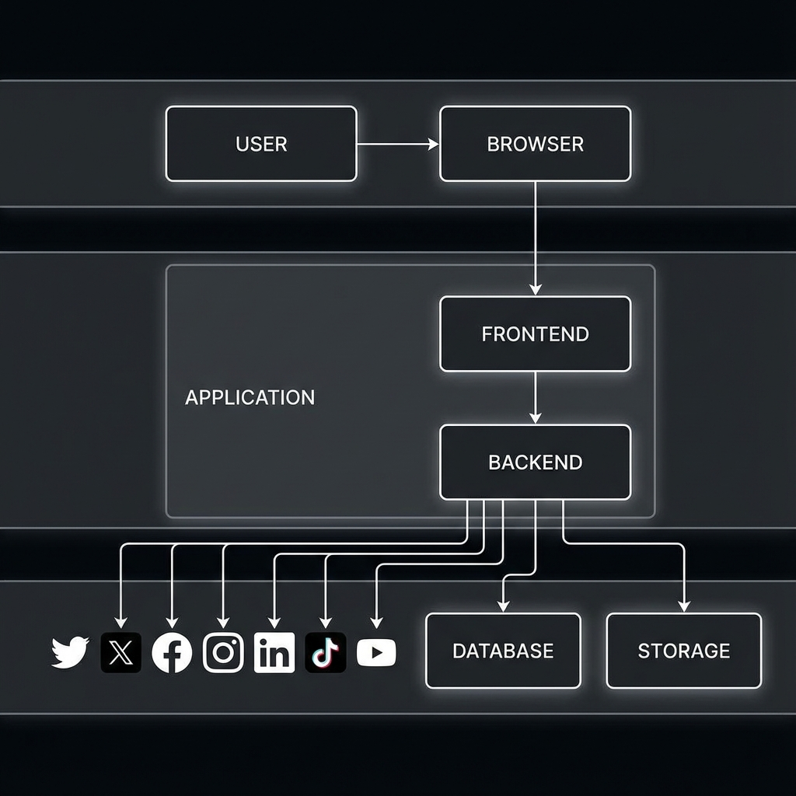
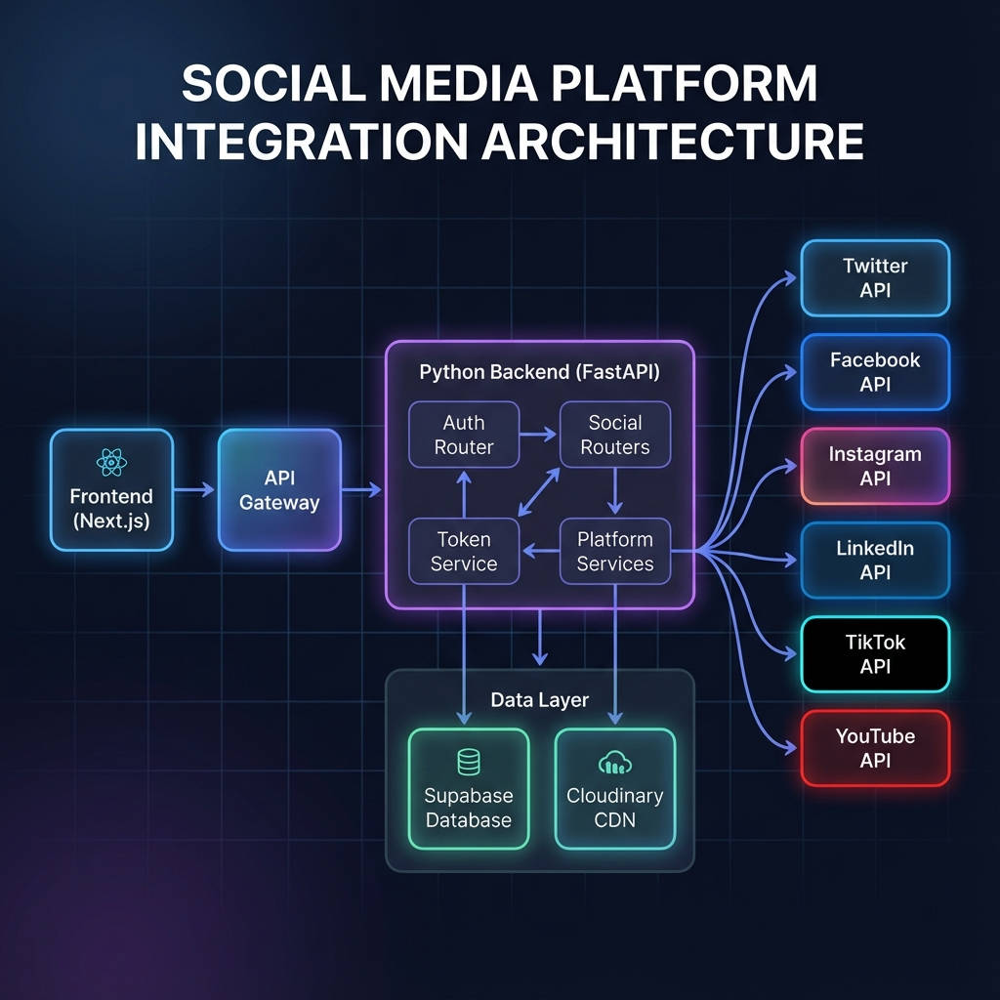
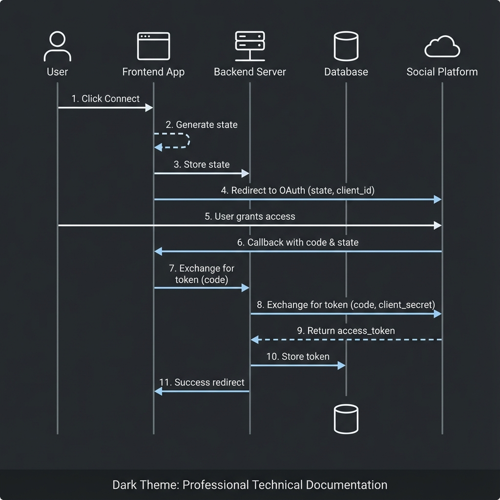
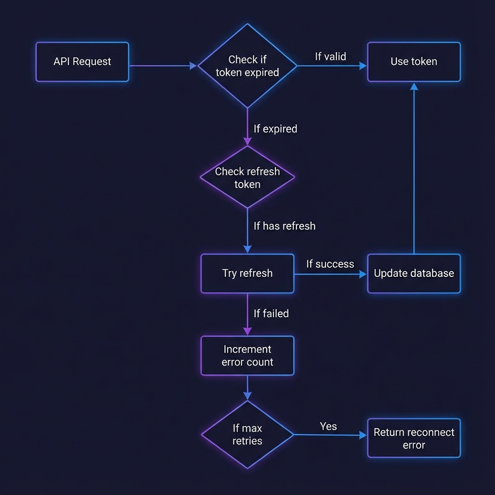
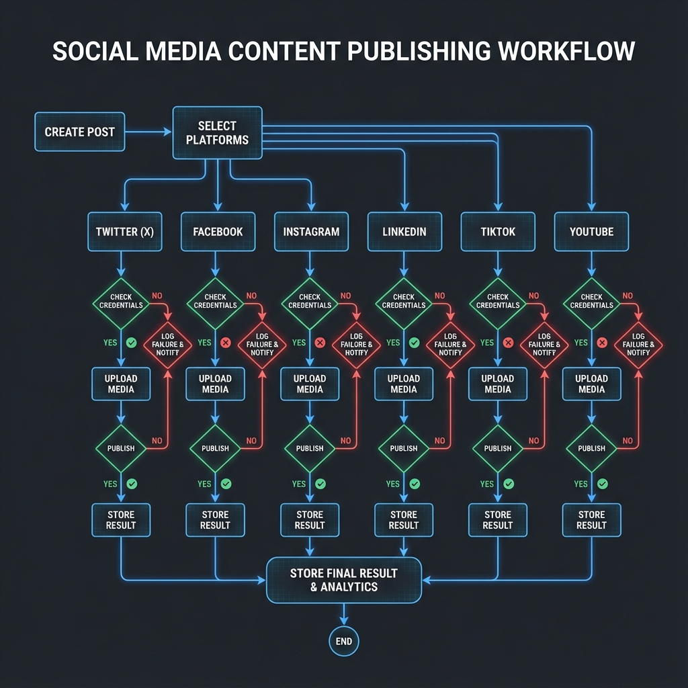
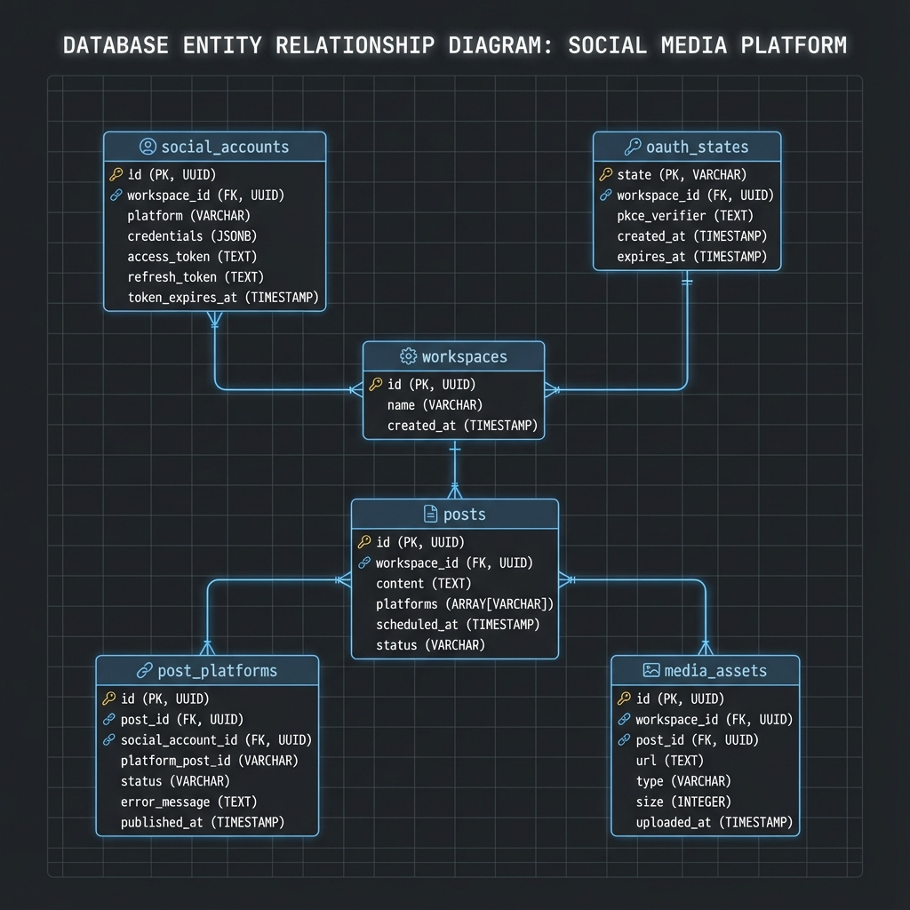

# Social Platform Integration Architecture

> **Version:** 1.0.0  
> **Last Updated:** December 2025  
> **Status:** Production Ready

This document provides a comprehensive overview of the social media platform integration architecture, including OAuth authentication, token management, content publishing, and data storage.

## High-Level Overview



---

## Table of Contents

1. [System Overview](#system-overview)
2. [Supported Platforms](#supported-platforms)
3. [Architecture Components](#architecture-components)
4. [OAuth Authentication Flow](#oauth-authentication-flow)
5. [Token Management](#token-management)
6. [Content Publishing Flow](#content-publishing-flow)
7. [Database Schema](#database-schema)
8. [API Endpoints](#api-endpoints)
9. [Error Handling](#error-handling)
10. [Security Considerations](#security-considerations)

---

## System Overview

The social platform integration system enables users to:
- Connect multiple social media accounts via OAuth
- Publish content to multiple platforms simultaneously
- Manage tokens with automatic refresh
- Track publishing status and analytics



### Architecture Layers

| Layer | Technology | Responsibility |
|-------|------------|----------------|
| Frontend | Next.js | UI, Platform Services |
| API Gateway | Next.js Rewrites | Route proxying to backend |
| Backend | FastAPI (Python) | Auth, Publishing, Token Management |
| Data | Supabase + Cloudinary | Storage, CDN |
| External | Platform APIs | Twitter, Facebook, etc. |

---

## Supported Platforms

| Platform | OAuth Type | Token Lifespan | Refresh Support |
|----------|------------|----------------|-----------------|
| **Twitter/X** | OAuth 2.0 PKCE | 2 hours | ✅ Yes |
| **Facebook** | OAuth 2.0 | 60 days | ✅ Yes (Long-lived) |
| **Instagram** | OAuth 2.0 (via Facebook) | 60 days | ✅ Yes |
| **LinkedIn** | OAuth 2.0 | 60 days | ✅ Yes |
| **TikTok** | OAuth 2.0 | 24 hours | ✅ Yes |
| **YouTube** | OAuth 2.0 | 1 hour | ✅ Yes (Indefinite refresh) |

---

## Architecture Components

### Backend Structure

```
python_backend/src/
├── api/v1/
│   ├── auth.py              # OAuth initiation & callbacks
│   ├── credentials.py       # Credential management API
│   ├── token_refresh.py     # On-demand token refresh API
│   └── social/
│       ├── twitter.py       # Twitter posting endpoints
│       ├── facebook.py      # Facebook posting endpoints
│       ├── instagram.py     # Instagram posting endpoints
│       ├── linkedin.py      # LinkedIn posting endpoints
│       ├── tiktok.py        # TikTok posting endpoints
│       └── youtube.py       # YouTube posting endpoints
│
├── services/
│   ├── social_service.py           # Facebook/Instagram Graph API
│   ├── token_refresh_service.py    # Centralized token refresh
│   ├── oauth_service.py            # OAuth state management
│   └── platforms/
│       ├── twitter_service.py      # X API v2 client
│       ├── linkedin_service.py     # LinkedIn REST client
│       ├── tiktok_service.py       # TikTok API client
│       └── youtube_service.py      # YouTube API client
```

### Frontend Structure

```
src/services/platforms/
├── BasePlatformService.ts    # Abstract base class
├── twitterService.ts         # Twitter integration
├── facebookService.ts        # Facebook integration
├── instagramService.ts       # Instagram integration
├── linkedinService.ts        # LinkedIn integration
├── tiktokService.ts          # TikTok integration
└── youtubeService.ts         # YouTube integration
```

---

## OAuth Authentication Flow

### OAuth Sequence Diagram



### Flow Steps

1. **User Initiates** - Clicks "Connect [Platform]" button
2. **Generate State** - Backend creates unique state + PKCE challenge
3. **Store State** - State saved to `oauth_states` table with expiry
4. **Redirect** - User sent to platform OAuth consent screen
5. **User Grants** - User approves requested permissions
6. **Callback** - Platform redirects to callback URL with code
7. **Verify State** - Backend validates state matches stored value
8. **Exchange Token** - Code exchanged for access/refresh tokens
9. **Store Credentials** - Tokens stored encrypted in `social_accounts`
10. **Success Redirect** - User sent to success page

### PKCE Security (Twitter)

For enhanced security, Twitter uses PKCE:
- **Code Verifier**: Random 128-character string
- **Code Challenge**: SHA256 hash of verifier (Base64 URL encoded)
- **Verification**: Platform verifies challenge on token exchange

---

## Token Management

### On-Demand Refresh Strategy

The system uses **on-demand token refresh** - no cron jobs required. Tokens are refreshed automatically when making API calls if expired.



### Refresh Decision Flow

| Condition | Action |
|-----------|--------|
| Token valid | Use existing token |
| Token expired + has refresh | Attempt refresh |
| Refresh successful | Update DB, use new token |
| Refresh failed (retry < 3) | Retry refresh |
| Refresh failed (max retries) | Return `needs_reconnect` |
| No refresh token | Return `needs_reconnect` |

### Token Expiration by Platform

| Platform | Access Token | Refresh Token |
|----------|--------------|---------------|
| Twitter | 2 hours | 6 months |
| Facebook | 60 days | N/A (use access token) |
| Instagram | 60 days | N/A (use access token) |
| LinkedIn | 60 days | 1 year |
| TikTok | 24 hours | 365 days |
| YouTube | 1 hour | Indefinite |

---

## Content Publishing Flow

### Multi-Platform Publishing



### Publishing Steps

1. **Create Post** - User composes content with media
2. **Select Platforms** - Choose target platforms
3. **Platform Templates** - Apply platform-specific formatting
4. **For Each Platform**:
   - Get valid credentials (auto-refresh if needed)
   - Upload media to platform (if applicable)
   - Publish content
   - Store `platform_post_id` in database
5. **Return Results** - Combined success/failure status

### Platform Content Support

| Platform | Post | Image | Video | Carousel | Reel | Story |
|----------|------|-------|-------|----------|------|-------|
| Twitter | ✅ | ✅ | ✅ | ❌ | ❌ | ❌ |
| Facebook | ✅ | ✅ | ✅ | ✅ | ✅ | ✅ |
| Instagram | ✅ | ✅ | ✅ | ✅ | ✅ | ✅ |
| LinkedIn | ✅ | ✅ | ✅ | ✅ | ❌ | ❌ |
| TikTok | ❌ | ❌ | ✅ | ❌ | ❌ | ❌ |
| YouTube | ❌ | ❌ | ✅ | ❌ | ✅ (Shorts) | ❌ |

---

## Database Schema

### Entity Relationship Diagram



### Core Tables

#### `social_accounts`
Stores connected platform credentials:

| Column | Type | Description |
|--------|------|-------------|
| id | UUID | Primary key |
| workspace_id | UUID | FK to workspaces |
| platform | ENUM | twitter, facebook, etc. |
| credentials_encrypted | TEXT | Encrypted JSONB credentials |
| refresh_token_encrypted | VARCHAR | Encrypted refresh token |
| expires_at | TIMESTAMP | Token expiration time |
| last_refreshed_at | TIMESTAMP | Last refresh timestamp |
| refresh_error_count | INT | Failed refresh attempts |
| is_connected | BOOL | Connection status |

#### `oauth_states`
Temporary OAuth state storage:

| Column | Type | Description |
|--------|------|-------------|
| id | UUID | Primary key |
| workspace_id | UUID | FK to workspaces |
| platform | ENUM | Target platform |
| state | VARCHAR | Unique state string |
| code_challenge | VARCHAR | PKCE challenge |
| expires_at | TIMESTAMP | State expiration (10 min) |
| is_used | BOOL | Prevents replay attacks |

#### `posts` / `post_platforms`
Post tracking per platform:

| Column | Type | Description |
|--------|------|-------------|
| platform_post_id | VARCHAR | Platform's post ID |
| platform_status | VARCHAR | posted, failed, pending |
| posted_at | TIMESTAMP | Publish timestamp |

---

## API Endpoints

### Authentication

| Method | Endpoint | Description |
|--------|----------|-------------|
| POST | `/api/auth/oauth/{platform}/initiate` | Start OAuth flow |
| GET | `/api/auth/oauth/{platform}/callback` | OAuth callback |

### Token Management

| Method | Endpoint | Description |
|--------|----------|-------------|
| GET | `/api/tokens/get/{platform}` | Get valid credentials |
| POST | `/api/tokens/refresh/{platform}` | Force refresh |
| GET | `/api/tokens/status` | All token statuses |

### Publishing

| Method | Endpoint | Description |
|--------|----------|-------------|
| POST | `/api/twitter/post` | Post to Twitter |
| POST | `/api/facebook/post` | Post to Facebook |
| POST | `/api/instagram/post` | Post to Instagram |
| POST | `/api/linkedin/post` | Post to LinkedIn |
| POST | `/api/tiktok/post` | Post to TikTok |
| POST | `/api/youtube/upload` | Upload to YouTube |

---

## Error Handling

### Error Types

| Code | Description | User Action |
|------|-------------|-------------|
| `token_expired` | Token needs refresh | Automatic |
| `refresh_failed` | Couldn't refresh | Reconnect account |
| `rate_limited` | API rate limit | Wait and retry |
| `invalid_credentials` | Token revoked | Reconnect account |
| `platform_error` | Platform API error | Check platform |

### Error Response Format

```json
{
  "success": false,
  "error": "Token expired and refresh failed",
  "error_type": "refresh_failed",
  "needs_reconnect": true,
  "platform": "twitter"
}
```

---

## Security Considerations

### Token Security
- ✅ Credentials encrypted at rest in database
- ✅ PKCE used for OAuth 2.0 flows
- ✅ OAuth states expire in 10 minutes
- ✅ State validation prevents CSRF attacks

### API Security
- ✅ JWT required for all authenticated endpoints
- ✅ Workspace isolation enforced
- ✅ HTTPS required in production
- ✅ Rate limiting on all endpoints

### Audit Trail
- ✅ `credential_audit_log` tracks all token operations
- ✅ IP address and user agent logged
- ✅ Success/failure status recorded

---

## Appendix: Platform API Versions

| Platform | API Version | Documentation |
|----------|-------------|---------------|
| Twitter/X | v2 | [X API Docs](https://developer.twitter.com/en/docs/twitter-api) |
| Facebook | v24.0 | [Graph API Docs](https://developers.facebook.com/docs/graph-api) |
| Instagram | v24.0 | [Instagram API Docs](https://developers.facebook.com/docs/instagram-graph-api) |
| LinkedIn | v2 / REST | [LinkedIn API Docs](https://learn.microsoft.com/linkedin/) |
| TikTok | v2 | [TikTok API Docs](https://developers.tiktok.com/) |
| YouTube | v3 | [YouTube API Docs](https://developers.google.com/youtube/v3) |

---

*Document generated: December 2025*
